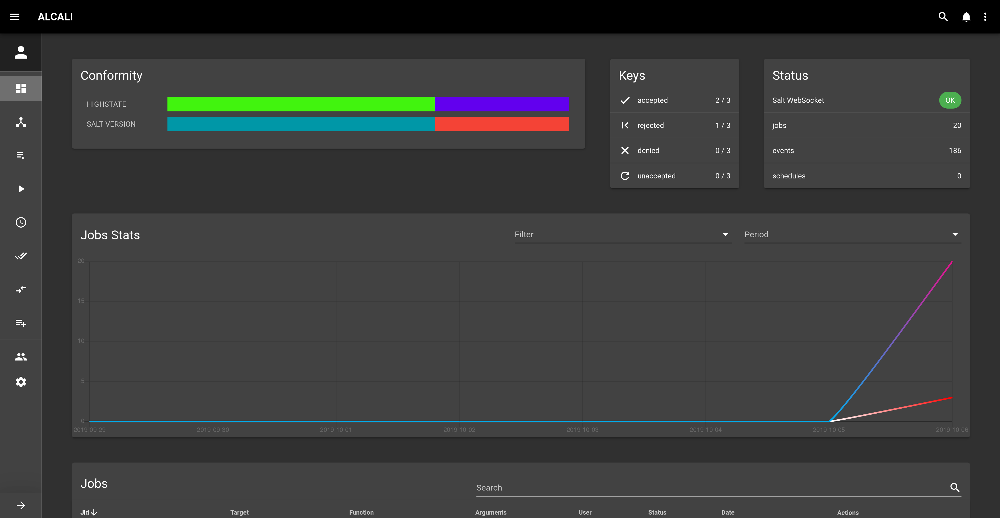
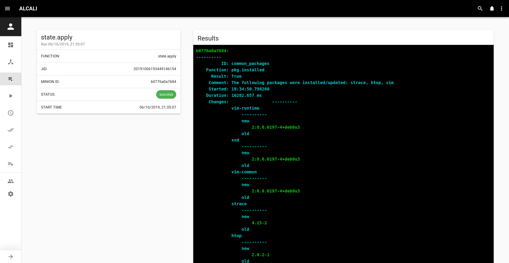

# Alcali

[](https://github.com/latenighttales/alcali/actions/workflows/test_on_push.yml)
[](https://opensource.org/licenses/MIT)
[](https://dependabot.com)
[](https://codecov.io/gh/latenighttales/alcali)
[](https://github.com/python/black)


## What's Alcali?

Alcali is a web based tool for monitoring and administrating **Saltstack** Salt.

## Features

- Get notified in real time when a job is created, updated or has returned. 

- Store your jobs results by leveraging the `master_job_store` setting with database master returner.

- Check your minions conformity to their highstate or **any state**.

- Keep track of custom state at a glance.

- Use custom auth module to login into both Alcali and the Salt-api using JWT.

- **LDAP** and **Google OAuth2** authentication.

## Try it!

If you just want to have a look, just clone the [repository](https://github.com/latenighttales/alcali.git) and use [docker-compose](https://docs.docker.com/compose/):

```commandline
git clone https://github.com/latenighttales/alcali.git
cd alcali
docker-compose up --scale minion=2
```


Once you see minions waiting to be approved by the master, you're good to go:

```commandline
...
minion_1  | [ERROR   ] The Salt Master has cached the public key for this node, this salt minion will wait for 10 seconds before attempting to re-authenticate
minion_1  | [INFO    ] Waiting 10 seconds before retry.
...
```

Just connect on [http://127.0.0.1:8000](http://127.0.0.1:8000), login with:

```commandline
username: admin
password: password
```

and follow the [walkthrough](https://alcali.dev/walkthrough/).

## Installation

The easiest way to install it is to use the salt [formula](https://github.com/latenighttales/alcali-formula).

Make sure to check the [installation](https://alcali.dev/installation/) docs first!

## Screenshots

#### Dashboard


#### Minion Details


#### Job Details


More [here](https://github.com/latenighttales/alcali/blob/2019.2/docs/docs/screenshots.md).

## License

[MIT](LICENSE)

<sub><sub>Image: Jean-Philippe WMFr, derivative work : User:Benoit Rochon [CC BY-SA 4.0](https://creativecommons.org/licenses/by-sa/4.0)</sub></sub>

## Contributing

If you'd like to contribute, check the [contribute](https://alcali.dev/contribute/) documentation on how to install a dev environment and submit PR!

And if you like this project, consider donating:

via GitHub Sponsors, or

[](https://ko-fi.com/J3J3173F6)


## Changelog

## [3003.1.0] - 2021-04-23

- int: updated deps (#317)

- fix: py36 compatible (#306)

- fix: non-standard-minion-response (#281)

- int: offline version (#225)

[3003.1.0]: https://github.com/latenighttales/alcali/compare/v3003.1.0...HEAD


## [3000.1.0] - 2020-04-26

- use salt 3000

- updated deps (#185)

- fix: UI errors (#187)

- fix: users are able to reset their pw (#184)

- fix: responsive layout (#178)

[3000.1.0]: https://github.com/latenighttales/alcali/compare/v2019.2.5...HEAD

## [2019.2.4] - 2020-02-14

- fix: password update (#164)

- update deps 20200207 (#155)

- fix: Less restrictive minion_id regex and error mgmt (#140)

[2019.2.4]: https://github.com/latenighttales/alcali/compare/v2019.2.4...HEAD

## [2019.2.3] - 2019-12-10

- feat: Google OAuth2 (#130)

- updated deps (#111)

- feat: Group jobs by jid (#106)

- int: error mgmt (#105)

- fix: favicon and boolrepr (#102)

- fix: removed useless icon files, fixed boolean repr (#100)

- fix: state render,Layout removed admin

- feat: predefined jobs (#98)

- fix: Boolean repr (#97)

- feat: LDAP auth backend (#84)

- fix: async run, updated deps (#82)

- feat: fold/unfold all

- feat: display current version in gui and cli dynamically (#76)

- fix: timezone, success bool for custom modules (#75)

- async link: resolve #69 (#74)

- feat: schedule disable/enable (#72)

- fix: schedules, keys, updated vuetify (#71)

- int: updated docs, added contribute section, screenshots (#62)

[2019.2.3]: https://github.com/latenighttales/alcali/compare/v2019.2.3...v2019.2.4

## [2019.2.2] - 2019-09-21

- use slim docker image

- Added rest auth

- Added pillar override

- Updated deps

[2019.2.2]: https://github.com/latenighttales/alcali/compare/v2019.2.2...v2019.2.3

## [2019.2.1] - 2019-09-21

- Frontend refactor

[2019.2.1]: https://github.com/latenighttales/alcali/compare/v2019.2.1...v2019.2.2
