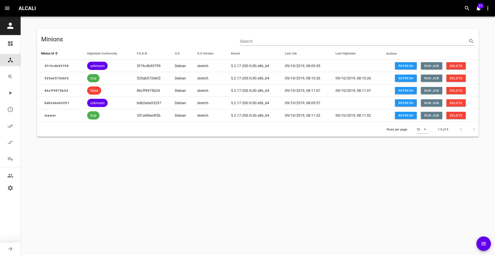

# Minions

List all minions currently in Alcali database.

To add more minions, use the action button and refresh all minions.

!!! info
    
    By default, refreshing minions will run `test.ping` `grains.items` and `pillar.items` on all minions responding to `test.ping`.
    
    If you add [custom minions fields](settings.md), the states you add will be run too.

To access [minion details](minion_details.md), click on the minion id.
