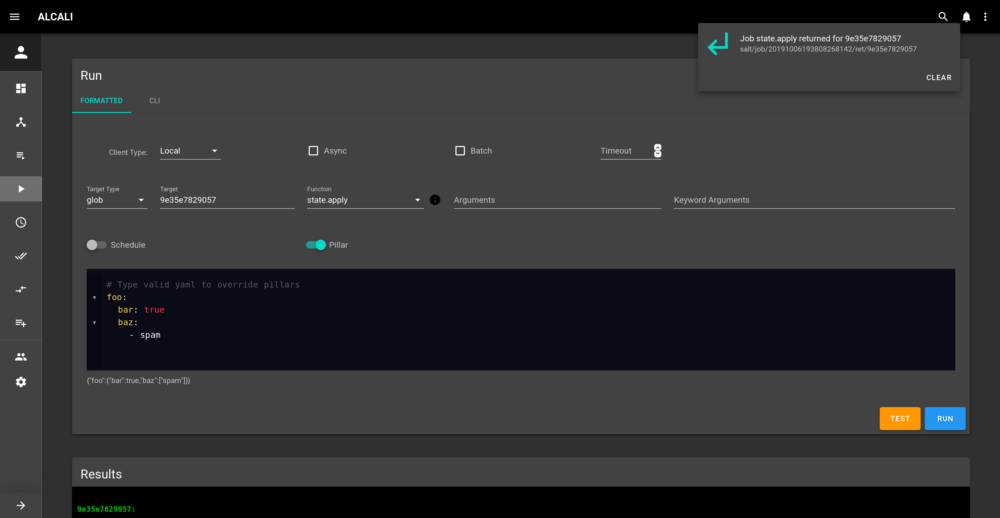
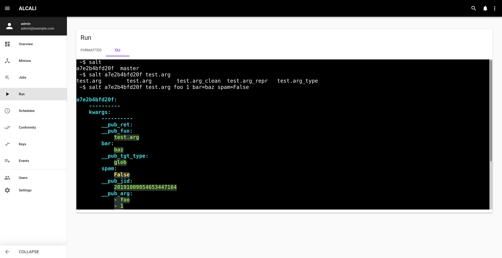

# Run

You can run job using either the formatted form or a pseudo cli.

## Formatted



For function completion and documentation, use the [parse module](settings.md#parse-modules) setting. Your custom modules should also be present.

#### Client type

 - Local: Run execution modules synchronously. Sends a command from the master to the targeted minions. This is the same interface that Salt's own CLI uses.
 
 - Runner: Master side execution sequences.
 
 - Wheel: Master side management routine.

#### Target type


#### Target

This depends on the selected [Target type](#target-type).

#### Function

Function completion and documentation are taken from the [parse module](settings.md#parse-modules) setting.

#### Args and Keyword Arguments

Use these fields for functions. If functions use **named** args or kwargs, they should be suggested.

#### Schedule

Schedule a recurring job, or postpone it.

### Test button

The **test** button will run the selected function with `#!python test=True` kwarg added set.

## CLI



This pseudo CLI should work like the salt command.

There's a basic completion on minions and states.

If you want to run a state using another [client type](#client-type) use `--client=` argument.

For example:

```commandline
salt --client=wheel key.list_all
```