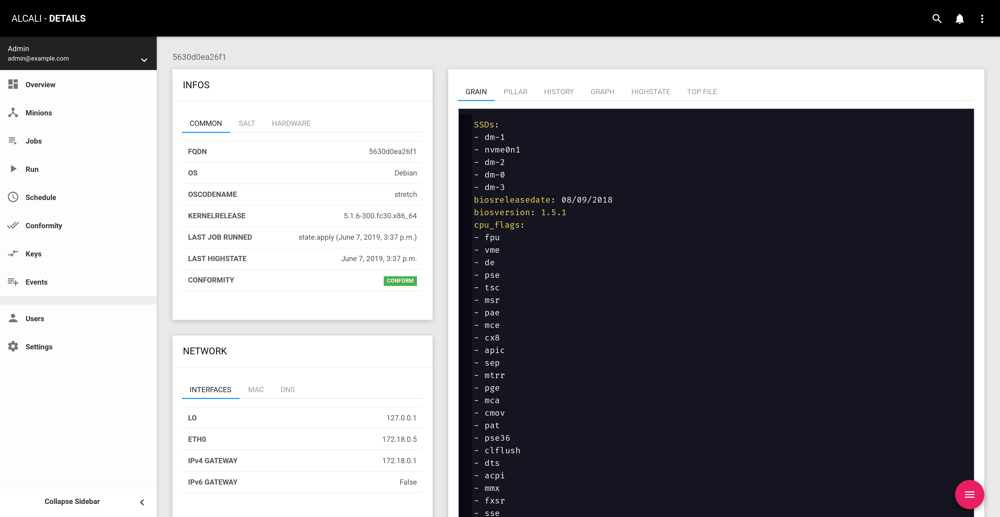

# Walkthrough

After you logged in at [http://localhost:8000](http://localhost:8000) with:

```commandline
username: admin
password: password
```

You should land on the Dashboard view.


For now it's empty, but you can already see that some **keys** are `UNACCEPTED`.


So let's go to the Keys view: [http://localhost:8000/keys](http://localhost:8000/keys)

## Accept keys


You can either accept keys one by one using the `ACCEPT` button, or use the _Fab_ button  to accept all keys.

## Add minions

Go to [http://localhost:8000/minions](http://localhost:8000/minions) and use the _Fab_ button  to refresh minions.


!!! info
    **By default**, refreshing minions will run:

    - `grains.items`
    - `pillar.items`

    on each connected minions.

## Minion detail

From the minions view, click on a `minion id` to see the minion detail, for example: [http://localhost:8000/minions/master/](http://localhost:8000/minions/master/).



Details are parsed from the `grains.items` state. On the right, 4 tabs are present for now:

  - `grains.items`
  - `pillar.items`
  - The last 100 jobs run on this minion
  - A graph of jobs run on this minion

We are going to add more useful infos using **minions fields**.

## Settings


