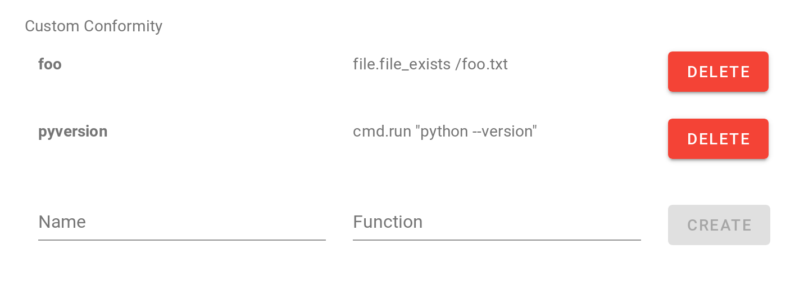
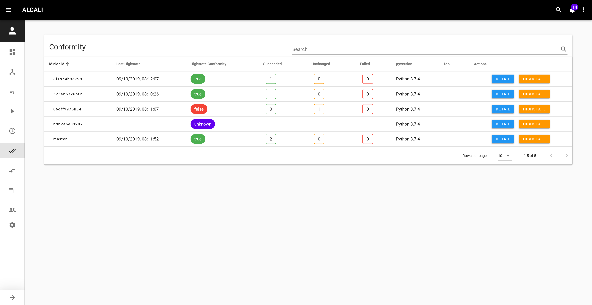

# Walkthrough

After you logged in at [http://localhost:8000/#/login](http://localhost:8000/#/login) with:

```commandline
username: admin
password: password
```

You should land on the Dashboard view.
</img>

For now it's empty, but you can already see that some **keys** are `UNACCEPTED`.


So let's go to the Keys view: [http://localhost:8000/#/keys](http://localhost:8000/#/keys)

## Accept keys


You can either accept keys one by one using the `ACCEPT` button, or use the action button  to accept all keys.

## Add minions

To store infos on connected minions, we need to add them to the database.

Go to [http://localhost:8000/#/minions](http://localhost:8000/#/minions) and use the action button  to refresh minions.


!!! info
    **By default**, refreshing minions will run:

    - `test.ping`
    - `grains.items`
    - `pillar.items`

    on each connected minions.

## Minion detail

From the minions view, you can click on a `minion id` to see its details, for example: [http://localhost:8000/#/minions/master/](http://localhost:8000/#/minions/master/).


Details are parsed from the `grains.items` state. On the right, 4 tabs are present for now:

  - `grains.items`
  - `pillar.items`
  - The last 100 jobs run on this minion
  - A graph of jobs run on this minion

Let's add some useful infos by setting some **minions fields**. To do so, go to the settings view [http://localhost:8000/#/settings](http://localhost:8000/#/settings).

## Settings

Choose a target and run the module parser to have documentation and module completion.

Let's add some minion fields.


We usually add:

 - highstate: `state.show_highstate`
 
 - top file: `state.show_top`

Use the action button to refresh all minions.

If you go see a minion's details, for example, [http://localhost:8000/#/minions/master/](http://localhost:8000/#/minions/master/), the new minion fields should be present.

Minion fields are usually used for "static" minion specific data.

For dynamic data, there's conformity.

As a config management tool, it's important to track state of files presence, software version, etc...

Custom conformity let you do that.



As an example, we'll add:

 - foo: `file.file_exists /foo.txt`
 
 - pyversion: `cmd.run "python --version"`
 
If you go to the [overview](http://localhost:8000), the two new custom conformity should be present but empty.


Let's go run some jobs to fix that.

## Run

Go to [http://localhost:8000/#/run](http://localhost:8000/#/run)

You can explore the formatted tab or just use the cli and run:

```commandline
salt master cmd.run "touch /foo.txt"
```

We just created the file `/foo.txt` on the master, so the master will comply to the "foo" conformity we added earlier.

Conformity is parsed from the states present in the database, so let's run:

```commandline
salt * cmd.run "python --version"
salt * file.file_exists "/foo.txt"
```

By the way, there should be tab completion in the CLI and documentation in the tooltip on the formatted tab thanks to the parse module action we did earlier. 

Finally, highstate any or all minions.

```commandline
salt master state.apply
```

## Conformity

In the overview, the conformity card should be filled now, with details when you hover it.


A table with both highstate conformity and your custom ones for all minions is available in the conformity view [http://localhost:8000/#/conformity](http://localhost:8000/#/conformity).



Details about each states in the highstate are available by clicking the `DETAIL` button.


